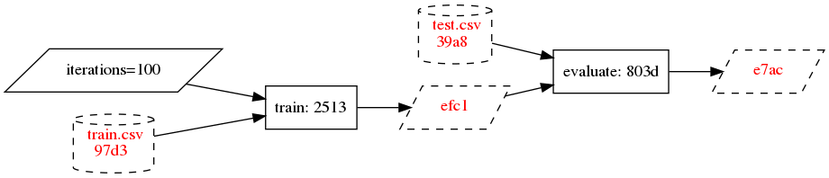

# MerkL - create ML pipelines with deep caching and tracking of datasets and models

MerkL is a tool for creating cachable ML pipelines in pure Python that are useful for development and experimentation,
but also easy to deploy to production. MerkL also works well together with [DVC](http://dvc.org) to store and track
large files such as training data and models in version control.

## Tour

In MerkL, pipelines are built out of functions decorated with the `task` decorator. When a task is called, the function
body is not exectuted immediately, but instead `Future` objects are returned in place of real outputs. These can then be passed on
to other tasks:

```python
from merkl import task

@task
def task1(input_value):
    return 2 * input_value

@task
def task2(input_value):
    return input_value ** 2

val = task1(3)
print(val)
print(val.eval())

final_val = task2(val)
print(final_val)
print(final_val.eval())
```
Prints:
```
<Future: 291b4697>
6
<Future: 51417ab7>
36
```

No function body is executed before `.eval()` is called on a Future. Instead a graph is built and each Future is
assigned a hash that uniquely identifies its future value. If the code or input values change, then the
output Future hashes also change. These hashes are then used to find cached results.

```python
def my_pipeline():
    val = task1(3)
    return task2(val)
```
We can visualize the graph using the `merkl dot` command which outputs the DAG in the dot file format:

`$ merkl dot test.my_pipeline | dot -Tpng | display`


Note: rendering an image and displaying it using this command requires graphviz and imagemagick to be installed

To run the code and produce the output value, use the `run` subcommand:

```
$ merkl run test.my_pipeline
36
```

Arguments can be passed to the pipeline like this:

```python
def my_pipeline(input_value: int):
    val = task1(input_value)
    return task2(val)
```

```
$ merkl run test.my_pipeline 3
36
```

See [clize](https://clize.readthedocs.io/en/stable/) for more information on how to pass parameters from the command line.

To set a default cache for all Future values, the `--cache file` option can be supplied:

`$ merkl run --cache file test.my_pipeline 3`

Now, when running rendering the DAG, cached values are highlighted in green:

`$ merkl dot --cache file test.my_pipeline 3 | dot -Tpng | display`


Let's say we change the `2` to a `3` in `task2` and re-run the command. Now the second future hash is different, and can't be found in the cache:


What would a slightly more realistic scenario look like? Here's a pipeline for a non-descript model training and
evaluation:

```python
from merkl import read_future

...

def train_eval():
    train_data = read_future('train.csv')
    test_data = read_future('test.csv')
    model = train(train_data, iterations=100)
    score = evaluate(model, test_data)
    return model, score
```

This pipeline assumes that `{train,test}.csv` are large files that we don't want to track in version control. We can use
[DVC](http://dvc.org) to track them:

`$ dvc add train.csv test.csv`

This moves a copy to the `.dvc/cache` folder, creates `{train,test}.csv.dvc` files containing the md5 hash. When a DVC
file is read in MerkL, only the md5 content hash is used when building the graph.

If we visualize this graph it looks like this:




Still missing:

* multiple outs (dict and tuple)
* batch
* merkl and DVC
* hashing modes
