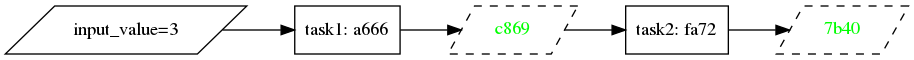
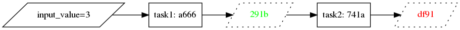

# MerkL - create ML pipelines with deep caching and tracking of datasets and models

MerkL is a tool for creating cachable ML pipelines in pure Python that are useful for development and experimentation,
but also easy to deploy to production. MerkL also provides a CLI to track and store data sets and trained models. The
concept is very similar to [DVC](http://dvc.org) but with a bigger focus on pipelines and deployment.

## Whirlwind tour

In MerkL, pipelines are built out of functions decorated with the `task` decorator. When a task is called, the function
body is not exectuted immediately, but instead `Future` objects are returned in place of real outputs. These can then be passed on
to other tasks:

```python
from merkl import task

@task
def task1(input_value):
    return 2 * input_value

@task
def task2(input_value):
    return input_value ** 2

val = task1(3)
print(val)
print(val.get())

final_val = task2(val)
print(final_val)
print(final_val.get())
```
Prints:
```
<Future: 291b4697>
6
<Future: 51417ab7>
36
```

No function body is executed before `.get()` is called on a Future. Instead a graph is built and each Future is
assigned a hash that uniquely identifies its future value. If the code or input values change, then the
output Future hashes also change. These hashes are then used to find cached results.

```python
def my_pipeline():
    val = task1(3)
    return task2(val)
```
We can visualize the graph using the `merkl dot` command which outputs the DAG in the dot file format:

`$ merkl dot test.my_pipeline | dot -Tpng | display`


Note: rendering an image and displaying it using this command requires graphviz and imagemagick to be installed

To run the code and produce the output value, use the `run` subcommand:

```
$ merkl run test.my_pipeline
36
```

Arguments can be passed to the pipeline like this:

```python
def my_pipeline(input_value: int):
    val = task1(input_value)
    return task2(val)
```

```
$ merkl run test.my_pipeline 3
36
```

See [clize](https://clize.readthedocs.io/en/stable/) for more information on how to pass parameters from the command line.

To set a default cache for all Future values, the `--cache file` option can be supplied:

`$ merkl run --cache file test.my_pipeline 3`

Now, when running rendering the DAG, cached values are highlighted in green:

`$ merkl dot --cache file test.my_pipeline 3 | dot -Tpng | display`



Let's say we change the `2` to a `3` in `task2` and re-run the command. Now the second future hash is different, and can't be found in the cache:



You can also specify the type of cache to use in the `task` decorator:

```python
from merkl import task, FileCache

@task(caches=[FileCache])
def task1(input_value):
    return 2 * input_value
```

Let's say we want to do some file IO. MerkL provides a command to "import" a file such that it can be used in MerkL
pipelines:

`$ merkl track my_file.csv`

This hashes the file creates a `my_file.csv.merkl` JSON file containing the hash, while copying the original file to the
file cache at `.merkl/cache`. If a `.gitignore` file is present, the file is also added to it. This way


## What problems does MerkL solve?

These are the relevant problems MerkL tries to tackle when developing, deploying and productionizing ML models and pipelines:

* Large training datasets and binary models are too large to version in git
* Code and data and results need to be versioned together so that you can track experiments, deploy easily, and know how a result was calculated (provenance)
* It would be benfitial to be able to use the same tools for ML as for the rest of the product
* In production and development, we want to cache final and intermediate results of ML pipelines
* We want to be able to create a pipeline during development, and easily deploy it without having to reimplement it
* Pipeline results from production should be easily reproducible in a dev environment

MerkL tries to solve these issues by:

1. Providing a way to off-load the storage of large files and only keep shallow references in git
2. Providing a way to chain together Python functions into pipelines, and fetch cached results without first having to executing the functions
3. Allow pipelines to be run as scripts or deployed directly in a web server without loss of efficiency or requiring
   changes

## Technical details

MerkL is inspired by [DVC](http://dvc.org) and aims to provide a subset of the same functionality, but differs in a few ways in implementation:

1. MerkL pipelines and functions are defined in pure Python and can be run from the command line as well as from a script or long-living server. Pipelines are thus suitable to be served from a web server without incurring the overhead of script start-up time or loading of dependencies for each invocation.
2. MerkL defines a [Merkle DAG](https://en.wikipedia.org/wiki/Merkle_tree) (Directed Asyclic Graph), containing the hashes of of the initial data, code and outputs. The output hashes are are the combined hashes of the inputs, the code, and the output index. All intermediate and final output hashes can therefore be calculated without having to execute any function body code. MerkL can then easily check if these values exist in the cache without the need for external logs of pipeline results.
3. Since pipelines are defined in code, one can create dynamic pipelines, e.g functions with variable number of inputs and outputs. This is possible since all normal control flow structures (if, for, while) are available when defining the pipeline in code.
4. Outputs can be saved to file, but since data is passed in memory between chained function calls (and cached by default), this is not mandatory.
5. Breakpoints and debugging works seamlessly since the pipeline and tasks run in a single Python script.

Besides this core functionality, MerkL provides some simple commands for tracking files and pushing/pulling them from
remote storage.

## Commands

`merkl init`
Creates a MerkL repository in the current directory. This creates the hidden `.merkl` folder which contains the local
cache and the `config` file. The `.merkl` directory is also added to the .gitignore if the file exists.

`merkl track <file>`
MerkL provides this command to move large files such as ML data sets or models to a cache folder outside of git, and track the file using its content hash instead. The steps that the command executes are:

1. Hash the file
2. Create a new file `<file>.merkl` containing the file hash and timestamp
3. Move the file to `.merkl/cache` and symlink it back to the git repo
4. Add `<file>` to `.gitignore` if there is one

`merkl run [--dry] [--fill-missing] [--no-cache] <module>.<function> [args] [--kwargs] [-0 <file>] [-1 <file>] ... [-N <file>]`
Run a pipeline or task function. Command line arguments are passed on as function arguments. The pipeline function is turned into a CLI using the [clize](https://clize.readthedocs.io/en/stable/#) library.
Paths for the outputs to be written to can be supplied with the `-n <file>` option, where n takes the value of the output index.
--dry: only the hashes are calculated, not the actual output values
--fill-missing: fill in any missing function arguments with future values (for dry runs)
--no-cache: do not fetch values from caches
--graph: outputs a graph in the dot format, which can be piped into `dot` and visualized with imagemagick: `merkl run --graph <module>.<pipeline> | dot -Tpng | display

`merkl push [<file>]`
Pushes tracked file to remote storage, e.g. Redis, S3, a relational database or a combination of destinations. If no
files are specified, then all tracked files in the project are pushed.

`merkl pull [<file>]`
Pulls tracked file from remote to local storage. If no files are specified, then all tracked files in the project are pushed.

## Nodes

A Python function can be turned into a pipline task by the use of the `merkl.task` decorator:

```
from merkl import task

@task
def my_function(input_value):
    return 2 * input_value
```

Node functions have these restrictions:

1. The function must be deterministic, i.e. all randomness needs to be seeded either by a constant in the function or
   by an input argument
2. The number of outputs need to be determinable without running the body of the function. By default the decorator
   assumes there to be a _single_ output, but it can be set to another constant value in the decorator:
   ```
   @task(outs=2)
   def my_function(input_value)
   ```

   If the number of outputs is variable and depends on the input arguments, `outs` can be set to a callable function with the
   same signature as the original function that returns the number of outputs:
   ```
   @task(outs=lambda input_value, k: k)
   def my_clustering_function(input_value, k=3)
   ```
   Note that the input arguments may contain futures for upstream calcalations that cannot be accessed.

The `task` decorator also takes these optional arguments:

* `serializers`: a map between out index and a MerkLSerializer class. The default serializer is JsonSerializer
* `cache_policy`: either a CachePolicy object or a map between output index and CachePolicy objects
* `code_hash_mode`: CodeHashMode.[FUNCTION,MODULE], defaults to MODULE. This means the code in the whole file the function
  resides in is used to compute the function hash
* `code_deps`: a list of modules functions, strings or bytes this function depends on for code hashing

## Pipelines

Pipelines can be defined anywhere, but can usefully be defined in a self-contained function, which can then be run with the `merkl
run <module>.<function>` command, or reused in a script.

When calling a MerkL task function, it returns one or several _Future_ objects (depending on number of
outs), which represents an value that hasn't been computed or fetched yet. In order to access the actual value, call
the `.get()` method on the future. This will perform the computation of the output and all needed preceding values
recursively, using cached values when available.

To persist a computed output to disk, call the `write_file(output, track=[True/False])` function. If `track=False`, the
file is written as-is. If True, the file is tracked the same way as when calling `merkl track <file>`.

[EXAMPLE HERE]

## Deploying

Deploying a pipeline is as easy as checking out the git repository and running the `merkl dry-run --pull --fill-missing <module>.<function> --model my_large_model.pickle`.
This does a dry-run of the pipeline without running any calculations, and pulls any referenced files that are cached (the model file).

## Serving

Serving a pipeline is done by simply running the pipeline function and returning the result. Any cached values will be
read locally or fetched remotely if available.

If the requester wants to save time by sending along the cached values, it can do a dry-run to get the cached values,
send them in the request, and on the server side those values can be added to the local cache.
